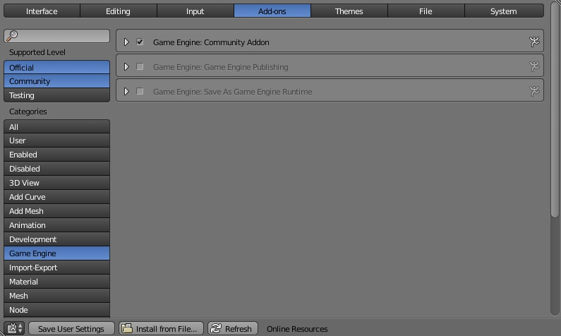

Welcome to the UPBGE's Community Addon docs!
=====================================================
The Community Addon is a framework for UPBGE. It adds features and fixes bugs that are yet to be patched in UPBGE, and it provides a new and easy to use hight level Python API.

The Community Addon for UPBGE can be downloaded or cloned from GitHub `here <https://github.com/elmeunick9/UPBGE-CommunityAddon/>`_. 

For your convenience we have divided the documentation in two blocks: Blender UI, wich are elements that requiere no coding knowloadge, and Python API, wich is a new API that you can use to further customize behaviour.

.. toctree::
   :maxdepth: 2
   :hidden:

   ui
   api
   changelog
   
Install
==================
This addon requieres an UPBGE, you can download its latest builds at: `https://download.upbge.org/ <https://download.upbge.org/>`_.

To install the addon open UPBGE and go to `File -> User Preferences -> Add-ons`, then click at the `Install from File...` button at the bottom of the window and select the addon file "`CommunityAddon.zip <https://github.com/elmeunick9/UPBGE-CommunityAddon/raw/master/addon/CommunityAddon.zip>`_".

After that the addon will be added to the list, mark the checkbox to enable it. Remember that for this installation to be persistent you need to click the `Save User Settings` button.
   
.. * :ref:`genindex`
.. * :ref:`search`

Click next to get to a step by step tutorial.