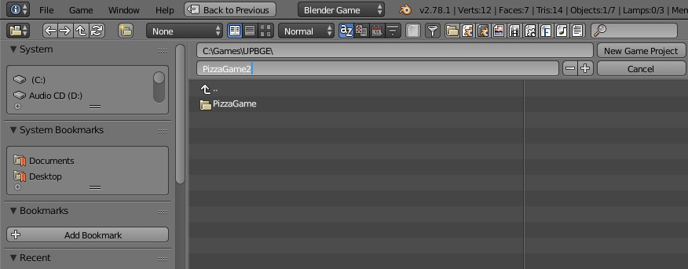
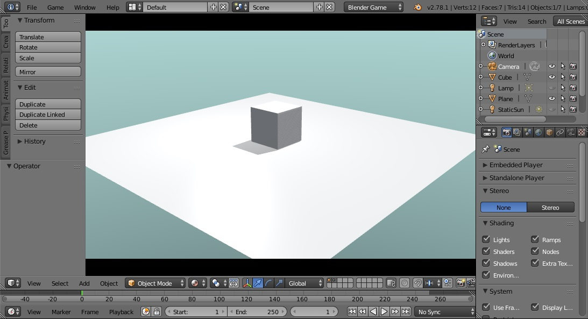
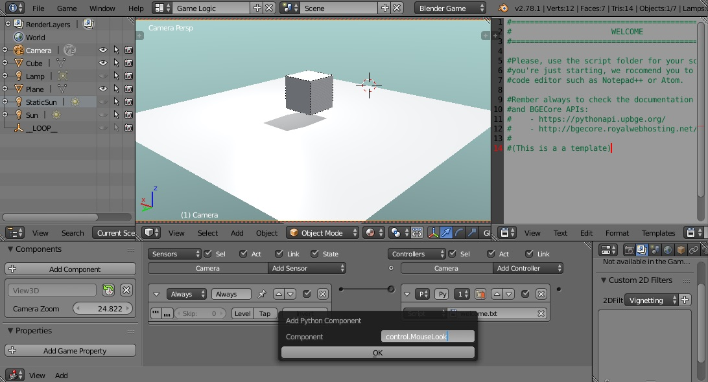
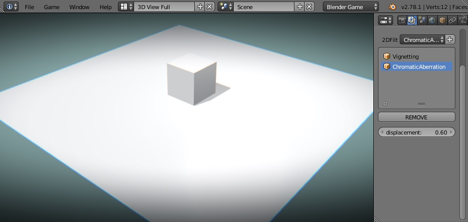

Blender UI
==================

.. currentmodule:: core

.. toctree::
  :maxdepth: 2
  :hidden:

  ui/components

Tutorial: First Steps
---------------------------------
To start working with the addon first you need to create a new game project. To do so go to `File -> Project -> New Game Project`. A file browser window will appear, select the distination folder and make sure to give a name to the project.

A new project working directory will be created with the name of the project. You will be able to open the working directory from inside blender going at `File -> Project -> Explore Project Directory`. Inside your project directory you will find a blend file named "main.blend", this is the main file of your game, and will be automatically opened. 

This `.blend` file is already configured, so all you need to do to start the game engine is press ``P``.

You can naviagte inside the game using the same controls as in the Blender Viewport, that is ``[Ctrl/Shift] + Middle Mouse + Movement`` and ``Scroll`` to zoom in/out. This behavior is enabled by default thanks to a component called `View3D <ui/components.html#control.View3D>`_. We can manage components from the `Logic Editor` in UPBGE. If you select the camera you will find such compenent on the left panel.

Finally we can add some custom `2D Filters <api/filter2D.html>`_ to our scene. For that, we switch to the `3D View Full` screen layout or open the `Properties -> Render Layers -> Custom 2D Filters` panel. On this example we are using the default settings for Vignette and ChromaticAberration filters.

