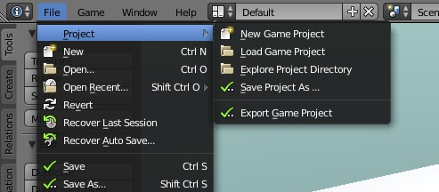
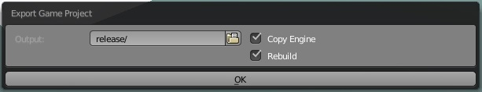
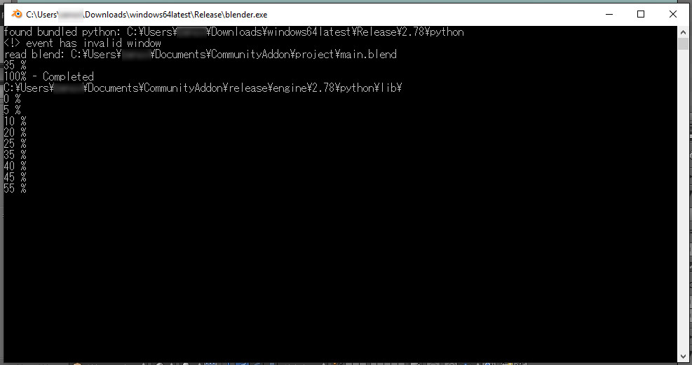

Game Project
=======================
Components are pre-defined behaviours that can be further customized with Python. You can find the python scripts at the `core/com` directory.

Project menu options
-----------------------------

This menu will appear once a project is opened. Their functions are as follows:

 * **New Game Project:** Creates a new project directory containing a basic template of the project. The template is designed to be highly portable and non-intrusive (not messing in the .blend). Opens the ``project/main.blend``.
 * **Load Game Project:** Loads a project directory. It works by either selecting the folder, the ``project.json`` file or the folder and any file in the ``project/`` directory.
 * **Explore Project Directory:** Opens a file browser on your project directory. (Actually the ``project/`` folder inside it, which contains must contain the data of your game).
 * **Save Project As:** Copies your project to another folder. If you input a compressed file (``*.zip``, ``*.tar``) it will compress the project and clean it by removing `unwanted files`.
		
		`Unwanted Files`: Include ``*.blend1..5``, ``__pycache__``, ``*.~`` and ``ehthumbs.db``.
 
 * **Export Game Project:** Opens a menu to export your game.
 
You should still use the ``Save`` button to save you ``main.blend`` file, or better use the shortcut ``Ctrl+S``.

 
Exporting the game
-----------------------------
.. note::
	Unfortunately the UPBGE team only provides standalone releases for Windows, therefore we have limited support to exporting games to Windows only. If you're using a different platform or want to try exporting to Linux or MacOS refer to the `Behind the scenes` section.
	

You can select the output folder where your game will be exported. You can either use a relative path (to your project folder) or an absolute path. The folder will be automatically created if it doesn't exist. We recommend using the "release" folder on your project directory.

* **Copy Engine:** If selected, the BlenderPlayer and Python (~80Mb) will be copied to output folder. The copy will take a while, you can consult the progress on the Blender Terminal. Only necessary the first build or if selecting the ``Rebuild`` option.

* **Rebuild:** Will delete the output directory if exists before copying files.

Like saving as a compressed file, exporting will clean the output directory of unwanted files. 

Behind the scenes
-----------------------------
If you decompress the package this addon comes in you will find yet another package called "data.zip" in the addon folder. This package contains the data this addon will use. This data is copied in the ``DATAFILES`` folder when enabling the addon. Usually at ``C:\Users\YourName\AppData\Roaming\Blender Foundation\Blender\2.78\datafiles\community\``.

.. note::
	You can access the "AppData\\Roaming" directory using the "%appdata%" command in your file browser path (Windows Only)
	
.. note::
	If you want to make sure, you can use ``bpy.utils.user_resource('DATAFILES')`` on you UPBGE's Python Console to get your actual path.

There you will find two folders: ``template`` and ``launcher``.

 * **Template:** Files on this folder will be copied when calling the ``New Game Project`` operator. 

 * **Launcher:** It includes executables for the launcher for each OS. The launcher is a program that will execute the following command ``cd data/; ./../engine/blenderplayer.exe main.blend``. More complex launchers may be used in the future, for example launchers using the "config.txt" file.
 
For more information about the original launcher `click here <https://blenderartists.org/forum/showthread.php?399943-BGECore-Launcher-Tutorial-Advanced-Publishing-Options>`_. 
 
The ``project.json`` file contains data about the game that is not included in any ``.blend`` file as well as data that needs to be passed between the engine (BGE) and the Blender (BPY).

Inside the ``project/core`` folder there is the Python API (Core) and any extra files it needs.

The launcher and the addon will automatically add the ``project/core/com`` folder of your project, containing components, to the PYTHONPATH.

To export manually you need to copy a compatible version of UPBGE's BlenderPlayer in your output ``engine/`` folder and create a luncher for it that does the same than this one for your platform.

.. note::
	If you've cloned this addon, you can create the "CommunityAddon.zip" and the "data.zip" file by executing ``make.py``. The same will be automatically done when committing, which will also call ``git add -A``. You can disable this behavior on the ``.git/hooks/pre-commit`` file of your repository.
